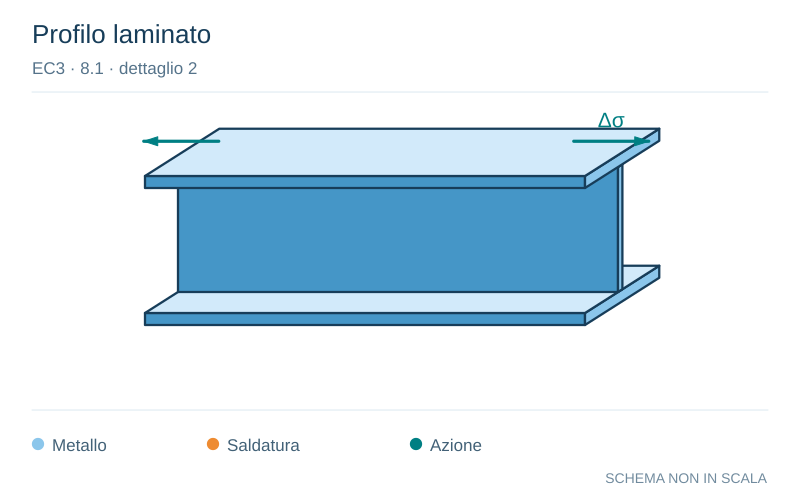

# EC3 · 8.1 · dettaglio 2

[Pagina estratta](../pages/ec3-022.md) · [PDF originale](../../sources/ec3.pdf#page=22)

**Profilo laminato.** Disegno vettoriale non in scala. [Apri / scarica il disegno SVG](../../assets/illustrations/ec3-022-t01-d01-02.svg).

Il blu rappresenta gli elementi metallici, l’arancio le saldature e il turchese le azioni. Simboli e proporzioni hanno funzione schematica; classi, dimensioni limite e condizioni applicabili sono quelle riportate nella fonte.

## Classificazione riportata

160

## Descrizione e condizioni

Prodotti laminati ed estrusi:
1) lamiere;
2) profilati laminati;
3) profilati tubolari senza saldatura a
sezione rettangolare o circolare.

## Requisiti e note

Particolari da 1) a 3):
Spigoli vivi, difetti
superficiali e di
laminazione da rimuovere
mediante rettifica fino ad
ottenere una transizione
graduale.

> Estrazione documentale da verificare. Le categorie non sono valori di progetto pronti per il calcolo. Celle condivise e varianti non vanno separate dalle condizioni.

## Contesto della classificazione

[Celle della tabella in Markdown](../tables/ec3-022-t01.md) · [Tabella nel PDF di riferimento](../../sources/ec3.pdf#page=22).
