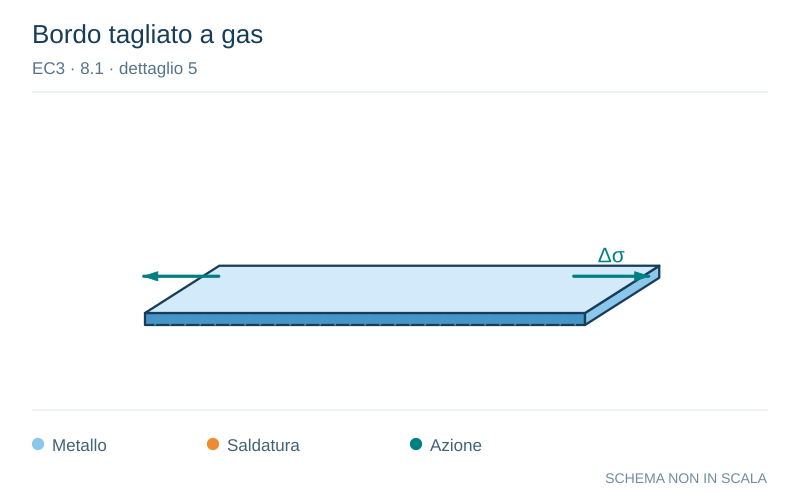

# EC3 · 8.1 · dettaglio 5

[Pagina estratta](../pages/ec3-022.md) · [PDF originale](../../sources/ec3.pdf#page=22)

**Bordo tagliato a gas.** Disegno vettoriale non in scala. [Apri / scarica il disegno SVG](../../assets/illustrations/ec3-022-t01-d03.svg).

Il blu rappresenta gli elementi metallici, l’arancio le saldature e il turchese le azioni. Simboli e proporzioni hanno funzione schematica; classi, dimensioni limite e condizioni applicabili sono quelle riportate nella fonte.

## Classificazione riportata

125

## Descrizione e condizioni

Lamiere tagliate meccanicamente o
all’ossitaglio:
4) materiale tagliato all’ossitaglio
automatico o meccanicamente con
successiva levigatura;
5) materiale tagliato all’ossitaglio
automatico avente tracce del taglio
superficiale e regolare o materiale
tagliato all’ossitaglio manualmente e
successivamente levigato in modo tale
da rimuovere tutte le discontinuità dei
bordi.
Taglio all’ossitaglio con qualità del taglio
secondo la EN 1090.

## Requisiti e note

4) Tutti i segni visibili di
discontinuità nei bordi
devono essere rimossi.
Tutte le aree di tagli
devono essere lavorate
meccanicamente o
molate e tutte le
sbavature devono essere
rimosse.
Tutte le abrasioni
meccaniche, per esempio
derivanti dalle operazioni
di molatura, possono
presentarsi solo
parallelamente alle
tensioni.
Particolari 4) e 5):
- angoli rientranti devono
essere rifiniti (pendenza
≤1⁄4) o valutati utilizzando
opportuni coefficienti di
concentrazione delle
tensioni;
- assenza di riparazioni
mediante saldatura.

> Estrazione documentale da verificare. Le categorie non sono valori di progetto pronti per il calcolo. Celle condivise e varianti non vanno separate dalle condizioni.

## Contesto della classificazione

[Celle della tabella in Markdown](../tables/ec3-022-t01.md) · [Tabella nel PDF di riferimento](../../sources/ec3.pdf#page=22).
