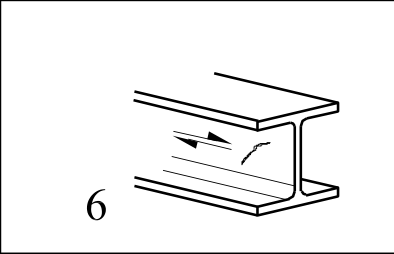
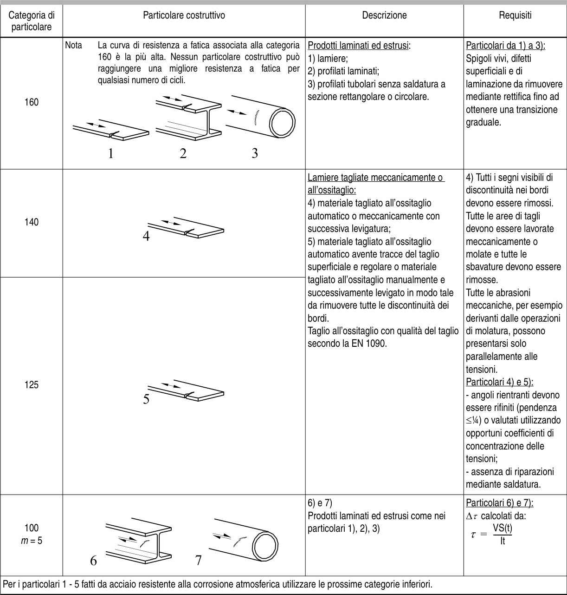

# EC3 · 8.1 · dettaglio 6

[Pagina estratta](../pages/ec3-022.md) · [PDF originale](../../sources/ec3.pdf#page=22)

## Classificazione riportata

100
m = 5

## Descrizione e condizioni

6) e 7)
Prodotti laminati ed estrusi come nei
particolari 1), 2), 3)

## Requisiti e note

Particolari 6) e 7):
∆τ calcolati da:
       VS(t)
τ =   ----------
              It

> Estrazione documentale da verificare. Le categorie non sono valori di progetto pronti per il calcolo. Celle condivise e varianti non vanno separate dalle condizioni.

## Tabella completa

