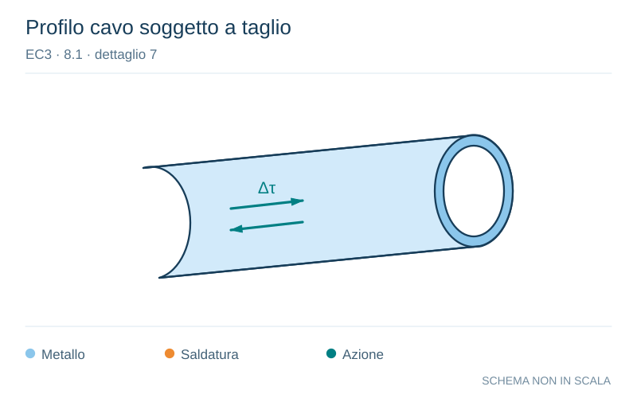

# EC3 · 8.1 · dettaglio 7

[Pagina estratta](../pages/ec3-022.md) · [PDF originale](../../sources/ec3.pdf#page=22)

**Profilo cavo soggetto a taglio.** Disegno vettoriale non in scala. [Apri / scarica il disegno SVG](../../assets/illustrations/ec3-022-t01-d04-02.svg).

Il blu rappresenta gli elementi metallici, l’arancio le saldature e il turchese le azioni. Simboli e proporzioni hanno funzione schematica; classi, dimensioni limite e condizioni applicabili sono quelle riportate nella fonte.

## Classificazione riportata

100
m = 5

## Descrizione e condizioni

6) e 7)
Prodotti laminati ed estrusi come nei
particolari 1), 2), 3)

## Requisiti e note

Particolari 6) e 7):
∆τ calcolati da:
       VS(t)
τ =   ----------
              It

> Estrazione documentale da verificare. Le categorie non sono valori di progetto pronti per il calcolo. Celle condivise e varianti non vanno separate dalle condizioni.

## Contesto della classificazione

[Celle della tabella in Markdown](../tables/ec3-022-t01.md) · [Tabella nel PDF di riferimento](../../sources/ec3.pdf#page=22).
