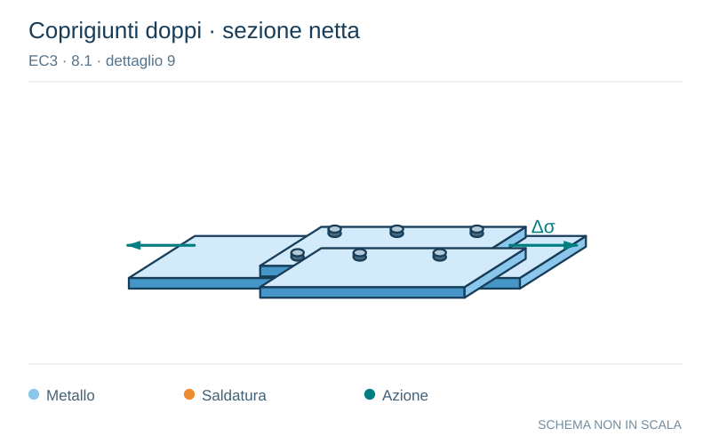

# EC3 · 8.1 · dettaglio 9

[Pagina estratta](../pages/ec3-023.md) · [PDF originale](../../sources/ec3.pdf#page=23)

**Coprigiunti doppi · sezione netta.** Disegno vettoriale non in scala. [Apri / scarica il disegno SVG](../../assets/illustrations/ec3-023-t01-d02.svg).

Il blu rappresenta gli elementi metallici, l’arancio le saldature e il turchese le azioni. Simboli e proporzioni hanno funzione schematica; classi, dimensioni limite e condizioni applicabili sono quelle riportate nella fonte.

## Classificazione riportata

90

## Descrizione e condizioni

9) Collegamenti
simmetrici con
doppio coprigiunto
e bulloni calibrati.

9) Collegamenti
simmetrici con
doppio coprigiunto
e bulloni stampati
non precaricati.

9) ... sezione
trasversale netta.

9) ... sezione
trasversale netta.

## Requisiti e note

In generale per
connessioni bullonate
[Particolari da 8) a 13)]:

Distanza dal bordo:
e1 ≥ 1,5 d

Distanza dal bordo:
e2 ≥ 1,5 d

Interasse:
p1 ≥ 2,5 d

Interasse:
p2 ≥ 2,5 d

Dettagli costruttivi figura
3.1 della EN 1993-1-8

> Estrazione documentale da verificare. Le categorie non sono valori di progetto pronti per il calcolo. Celle condivise e varianti non vanno separate dalle condizioni.

## Contesto della classificazione

[Celle della tabella in Markdown](../tables/ec3-023-t01.md) · [Tabella nel PDF di riferimento](../../sources/ec3.pdf#page=23).
