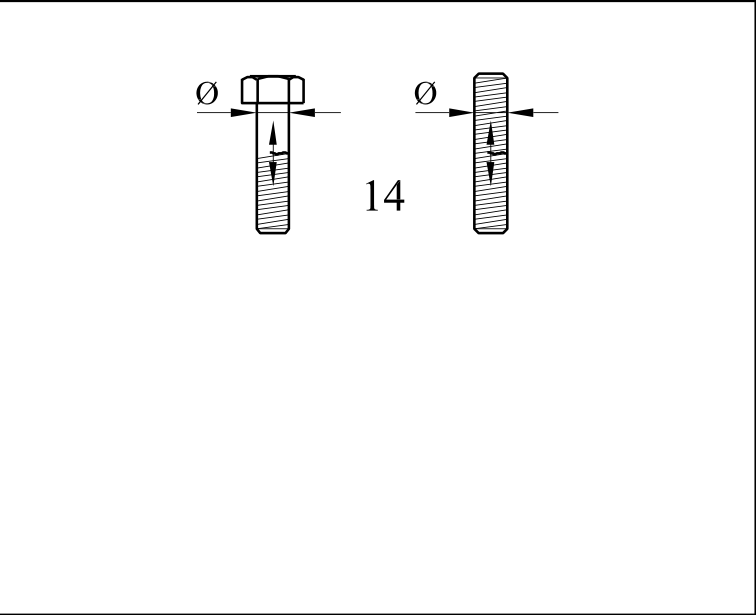

# EC3 · 8.1 · dettaglio 14

[Pagina estratta](../pages/ec3-024.md) · [PDF originale](../../sources/ec3.pdf#page=24)

## Classificazione riportata

50
Effetto scala
per ι> 30 mm:
ks = (30/ι)0,25

## Descrizione e condizioni

14) Bulloni e barre aventi filettature
laminate o tagliate soggette a
trazione.
Per grandi diametri (tirafondi)
l’effetto scala deve essere preso in
considerazione con ks.

## Requisiti e note

14) ∆σ calcolato
utilizzando l’area
resistente a trazione del
bullone.
Flessione e trazione
causate da effetti leva e
tensioni da flessione
derivanti da altre fonti
devono essere
considerate.
Per bulloni precaricati, la
riduzione dell’intervallo di
variazione della tensione
può essere preso in
considerazione.

> Estrazione documentale da verificare. Le categorie non sono valori di progetto pronti per il calcolo. Celle condivise e varianti non vanno separate dalle condizioni.

## Tabella completa

