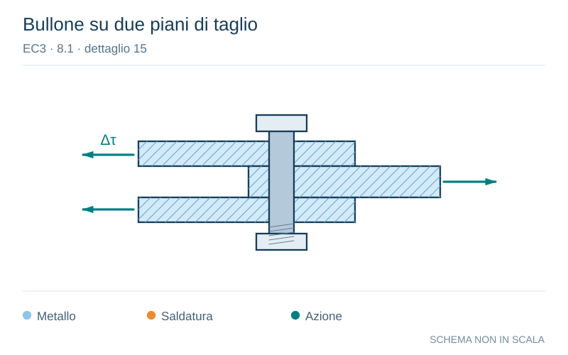

# EC3 · 8.1 · dettaglio 15

[Pagina estratta](../pages/ec3-024.md) · [PDF originale](../../sources/ec3.pdf#page=24)

**Bullone su due piani di taglio.** Disegno vettoriale non in scala. [Apri / scarica il disegno SVG](../../assets/illustrations/ec3-024-t01-d02.svg).

Il blu rappresenta gli elementi metallici, l’arancio le saldature e il turchese le azioni. Simboli e proporzioni hanno funzione schematica; classi, dimensioni limite e condizioni applicabili sono quelle riportate nella fonte.

## Classificazione riportata

100
m = 5

## Descrizione e condizioni

Bulloni sollecitati a taglio con
sezione di taglio singola o doppia
15)
- bulloni calibrati;
- bulloni normali in assenza di
inversione del carico (bulloni di
classe 5.6, 8.8 o 10.9).

## Requisiti e note

15)
∆τ calcolata utilizzando
l’area del gambo del
bullone.

> Estrazione documentale da verificare. Le categorie non sono valori di progetto pronti per il calcolo. Celle condivise e varianti non vanno separate dalle condizioni.

## Contesto della classificazione

[Celle della tabella in Markdown](../tables/ec3-024-t01.md) · [Tabella nel PDF di riferimento](../../sources/ec3.pdf#page=24).
