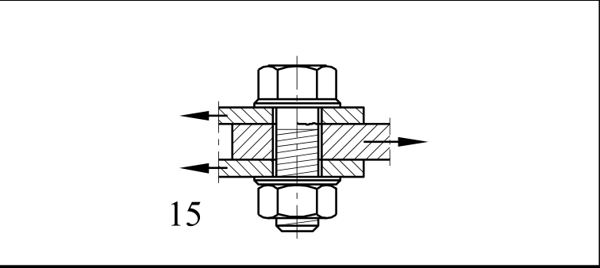

# EC3 · 8.1 · dettaglio 15

[Pagina estratta](../pages/ec3-024.md) · [PDF originale](../../sources/ec3.pdf#page=24)

## Classificazione riportata

100
m = 5

## Descrizione e condizioni

Bulloni sollecitati a taglio con
sezione di taglio singola o doppia
15)
- bulloni calibrati;
- bulloni normali in assenza di
inversione del carico (bulloni di
classe 5.6, 8.8 o 10.9).

## Requisiti e note

15)
∆τ calcolata utilizzando
l’area del gambo del
bullone.

> Estrazione documentale da verificare. Le categorie non sono valori di progetto pronti per il calcolo. Celle condivise e varianti non vanno separate dalle condizioni.

## Tabella completa

