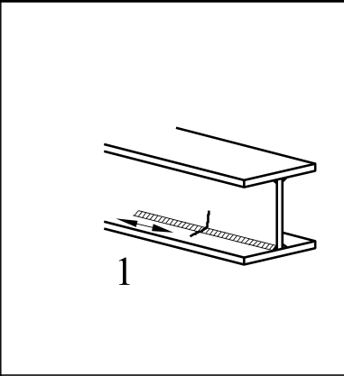
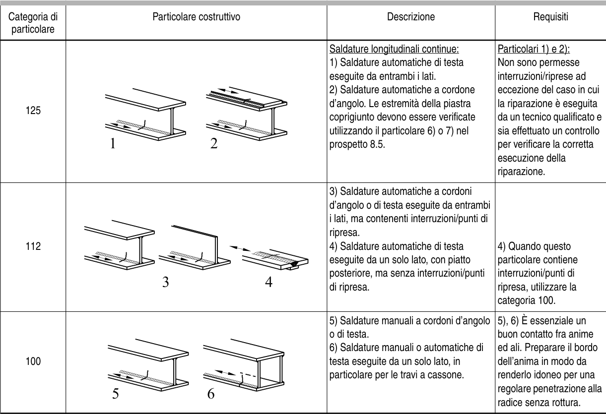

# EC3 · 8.2 · dettaglio 1

[Pagina estratta](../pages/ec3-024.md) · [PDF originale](../../sources/ec3.pdf#page=24)

## Classificazione riportata

125

## Descrizione e condizioni

Saldature longitudinali continue:
1) Saldature automatiche di testa
eseguite da entrambi i lati.
2) Saldature automatiche a cordone
d’angolo. Le estremità della piastra
coprigiunto devono essere verificate
utilizzando il particolare 6) o 7) nel
prospetto 8.5.

## Requisiti e note

Particolari 1) e 2):
Non sono permesse
interruzioni/riprese ad
eccezione del caso in cui
la riparazione è eseguita
da un tecnico qualificato e
sia effettuato un controllo
per verificare la corretta
esecuzione della
riparazione.

> Estrazione documentale da verificare. Le categorie non sono valori di progetto pronti per il calcolo. Celle condivise e varianti non vanno separate dalle condizioni.

## Tabella completa

