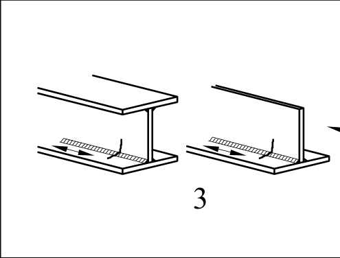

# EC3 · 8.2 · dettaglio 3

[Pagina estratta](../pages/ec3-024.md) · [PDF originale](../../sources/ec3.pdf#page=24)

## Classificazione riportata

112

## Descrizione e condizioni

3) Saldature automatiche a cordoni
d’angolo o di testa eseguite da entrambi
i lati, ma contenenti interruzioni/punti di
ripresa.
4) Saldature automatiche di testa
eseguite da un solo lato, con piatto
posteriore, ma senza interruzioni/punti
di ripresa.

## Requisiti e note

4) Quando questo
particolare contiene
interruzioni/punti di
ripresa, utilizzare la
categoria 100.

> Estrazione documentale da verificare. Le categorie non sono valori di progetto pronti per il calcolo. Celle condivise e varianti non vanno separate dalle condizioni.

## Tabella completa

