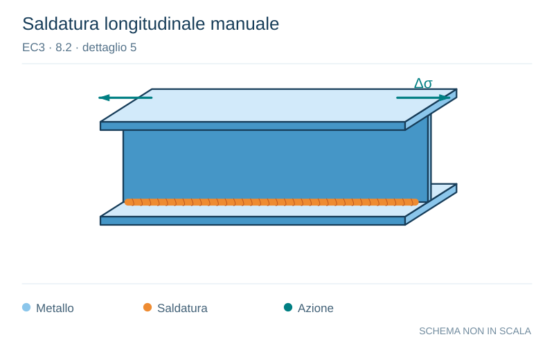

# EC3 · 8.2 · dettaglio 5

[Pagina estratta](../pages/ec3-024.md) · [PDF originale](../../sources/ec3.pdf#page=24)

**Saldatura longitudinale manuale.** Disegno vettoriale non in scala. [Apri / scarica il disegno SVG](../../assets/illustrations/ec3-024-t02-d03-01.svg).

Il blu rappresenta gli elementi metallici, l’arancio le saldature e il turchese le azioni. Simboli e proporzioni hanno funzione schematica; classi, dimensioni limite e condizioni applicabili sono quelle riportate nella fonte.

## Classificazione riportata

100

## Descrizione e condizioni

5) Saldature manuali a cordoni d’angolo
o di testa.
6) Saldature manuali o automatiche di
testa eseguite da un solo lato, in
particolare per le travi a cassone.

## Requisiti e note

5), 6) È essenziale un
buon contatto fra anime
ed ali. Preparare il bordo
dell’anima in modo da
renderlo idoneo per una
regolare penetrazione alla
radice senza rottura.

> Estrazione documentale da verificare. Le categorie non sono valori di progetto pronti per il calcolo. Celle condivise e varianti non vanno separate dalle condizioni.

## Contesto della classificazione

[Celle della tabella in Markdown](../tables/ec3-024-t02.md) · [Tabella nel PDF di riferimento](../../sources/ec3.pdf#page=24).
