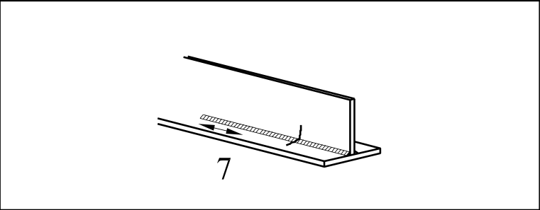

# EC3 · 8.2 · dettaglio 7

[Pagina estratta](../pages/ec3-025.md) · [PDF originale](../../sources/ec3.pdf#page=25)

## Classificazione riportata

100

## Descrizione e condizioni

7) Riparazioni di saldature automatiche
o manuali a cordoni d’angolo o di testa
per le categorie da 1) a 6).

## Requisiti e note

7) Miglioramento tramite
molatura eseguita da un
tecnico qualificato per
rimuovere segni visibili e
adeguate verifiche
possono ripristinare la
categoria originaria.

> Estrazione documentale da verificare. Le categorie non sono valori di progetto pronti per il calcolo. Celle condivise e varianti non vanno separate dalle condizioni.

## Tabella completa

