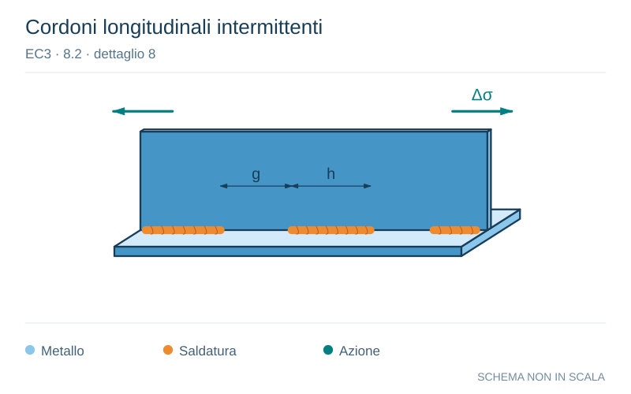

# EC3 · 8.2 · dettaglio 8

[Pagina estratta](../pages/ec3-025.md) · [PDF originale](../../sources/ec3.pdf#page=25)

**Cordoni longitudinali intermittenti.** Disegno vettoriale non in scala. [Apri / scarica il disegno SVG](../../assets/illustrations/ec3-025-t01-d02.svg).

Il blu rappresenta gli elementi metallici, l’arancio le saldature e il turchese le azioni. Simboli e proporzioni hanno funzione schematica; classi, dimensioni limite e condizioni applicabili sono quelle riportate nella fonte.

## Classificazione riportata

80

## Descrizione e condizioni

8) Saldature longitudinali alternate.

## Requisiti e note

8) ∆σ basato sulla
tensione normale nell’ala.

> Estrazione documentale da verificare. Le categorie non sono valori di progetto pronti per il calcolo. Celle condivise e varianti non vanno separate dalle condizioni.

## Contesto della classificazione

[Celle della tabella in Markdown](../tables/ec3-025-t01.md) · [Tabella nel PDF di riferimento](../../sources/ec3.pdf#page=25).
