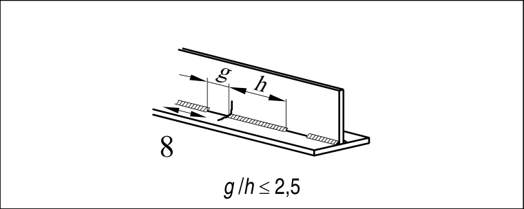

# EC3 · 8.2 · dettaglio 8

[Pagina estratta](../pages/ec3-025.md) · [PDF originale](../../sources/ec3.pdf#page=25)

## Classificazione riportata

80

## Descrizione e condizioni

8) Saldature longitudinali alternate.

## Requisiti e note

8) ∆σ basato sulla
tensione normale nell’ala.

> Estrazione documentale da verificare. Le categorie non sono valori di progetto pronti per il calcolo. Celle condivise e varianti non vanno separate dalle condizioni.

## Tabella completa

