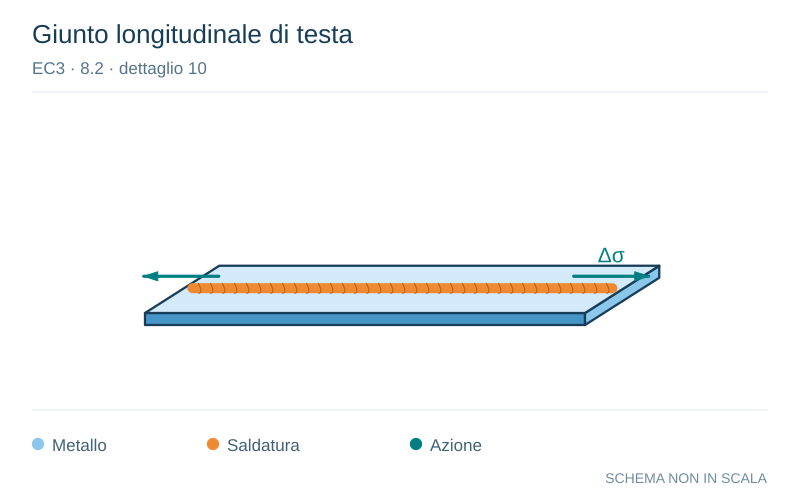

# EC3 · 8.2 · dettaglio 10

[Pagina estratta](../pages/ec3-025.md) · [PDF originale](../../sources/ec3.pdf#page=25)

**Giunto longitudinale di testa.** Disegno vettoriale non in scala. [Apri / scarica il disegno SVG](../../assets/illustrations/ec3-025-t01-d04.svg).

Il blu rappresenta gli elementi metallici, l’arancio le saldature e il turchese le azioni. Simboli e proporzioni hanno funzione schematica; classi, dimensioni limite e condizioni applicabili sono quelle riportate nella fonte.

## Classificazione riportata

125
112
90

## Descrizione e condizioni

10) Saldatura di testa longitudinale
livellata mediante rettifica su entrambi i
lati parallelamente alla direzione del
carico, 100% NDT.

10) Non molate e senza
interruzioni/punti di ripresa.

10) Con interruzioni/punti di ripresa.

## Requisiti e note

> Estrazione documentale da verificare. Le categorie non sono valori di progetto pronti per il calcolo. Celle condivise e varianti non vanno separate dalle condizioni.

## Contesto della classificazione

[Celle della tabella in Markdown](../tables/ec3-025-t01.md) · [Tabella nel PDF di riferimento](../../sources/ec3.pdf#page=25).
