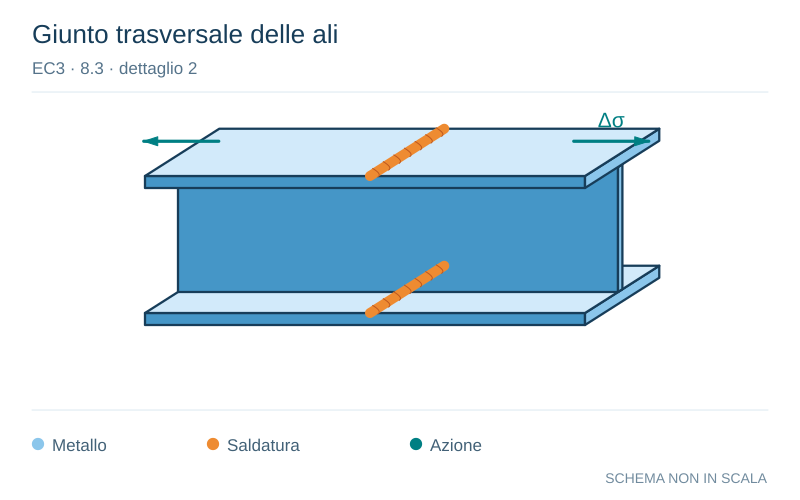

# EC3 · 8.3 · dettaglio 2

[Pagina estratta](../pages/ec3-026.md) · [PDF originale](../../sources/ec3.pdf#page=26)

**Giunto trasversale delle ali.** Disegno vettoriale non in scala. [Apri / scarica il disegno SVG](../../assets/illustrations/ec3-026-t01-d01-02.svg).

Il blu rappresenta gli elementi metallici, l’arancio le saldature e il turchese le azioni. Simboli e proporzioni hanno funzione schematica; classi, dimensioni limite e condizioni applicabili sono quelle riportate nella fonte.

## Classificazione riportata

112

## Descrizione e condizioni

Senza piatto posteriore:
1) Giunti trasversali in lamiere e
piatti.
2) Giunti di ali e anime in travi
composte prima dell’assemblaggio.
3) Profilati aventi sezioni trasversali
completamente saldate di testa o
profilati laminati senza fori di
scarico.
4) Giunti trasversali in piastre o piatti
rastremati nella larghezza o nello
spessore con una pendenza ≤1⁄4.

## Requisiti e note

- Tutte le saldature
livellate mediante rettifica
fino alla superficie della
piastra in direzione
parallela alla freccia.
- Utilizzare talloni di
estremità e rimuoverli
successivamente,
livellare mediante rettifica
le estremità delle lamiere
in direzione della
tensione.
- Saldature su entrambi i
lati; verificate secondo
NDT.
Particolare 3):
Si applica solo a
collegamenti di profilati
laminati, tagliati e
risaldati.

> Estrazione documentale da verificare. Le categorie non sono valori di progetto pronti per il calcolo. Celle condivise e varianti non vanno separate dalle condizioni.

## Contesto della classificazione

[Celle della tabella in Markdown](../tables/ec3-026-t01.md) · [Tabella nel PDF di riferimento](../../sources/ec3.pdf#page=26).
