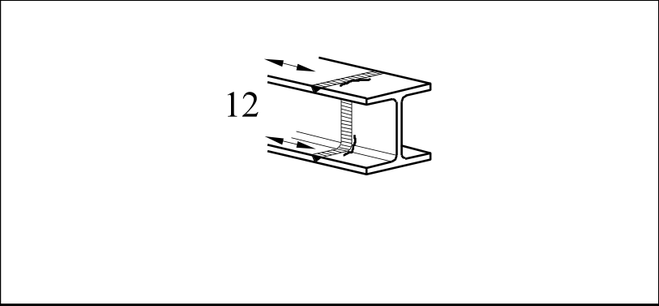

# EC3 · 8.3 · dettaglio 12

[Pagina estratta](../pages/ec3-027.md) · [PDF originale](../../sources/ec3.pdf#page=27)

## Classificazione riportata

63

## Descrizione e condizioni

12) Profilati aventi sezioni trasversali
completamente saldate di testa o
profilati laminati senza fori di scarico.

## Requisiti e note

- Utilizzare talloni di
estremità e rimuoverli
successivamente,
livellare mediante rettifica
le estremità delle lamiere
in direzione della
tensione.
- Saldature su entrambi i
lati.

> Estrazione documentale da verificare. Le categorie non sono valori di progetto pronti per il calcolo. Celle condivise e varianti non vanno separate dalle condizioni.

## Tabella completa

