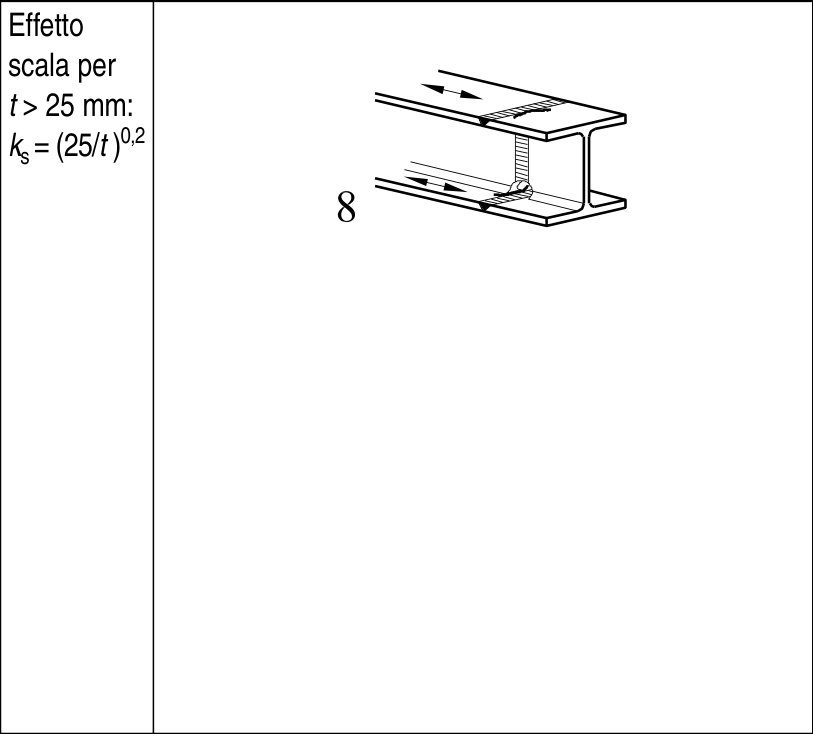
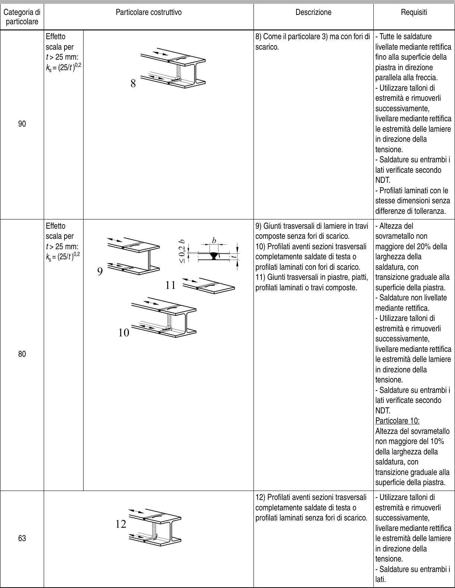

# EC3 · 8.3 · dettaglio 8

[Pagina estratta](../pages/ec3-027.md) · [PDF originale](../../sources/ec3.pdf#page=27)

## Classificazione riportata

90

## Descrizione e condizioni

8) Come il particolare 3) ma con fori di
scarico.

## Requisiti e note

- Tutte le saldature
livellate mediante rettifica
fino alla superficie della
piastra in direzione
parallela alla freccia.
- Utilizzare talloni di
estremità e rimuoverli
successivamente,
livellare mediante rettifica
le estremità delle lamiere
in direzione della
tensione.
- Saldature su entrambi i
lati verificate secondo
NDT.
- Profilati laminati con le
stesse dimensioni senza
differenze di tolleranza.

> Estrazione documentale da verificare. Le categorie non sono valori di progetto pronti per il calcolo. Celle condivise e varianti non vanno separate dalle condizioni.

## Tabella completa

