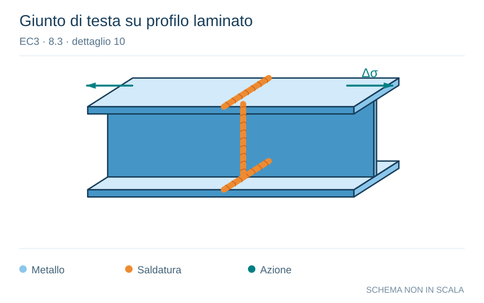

# EC3 · 8.3 · dettaglio 10

[Pagina estratta](../pages/ec3-027.md) · [PDF originale](../../sources/ec3.pdf#page=27)

**Giunto di testa su profilo laminato.** Disegno vettoriale non in scala. [Apri / scarica il disegno SVG](../../assets/illustrations/ec3-027-t01-d03-02.svg).

Il blu rappresenta gli elementi metallici, l’arancio le saldature e il turchese le azioni. Simboli e proporzioni hanno funzione schematica; classi, dimensioni limite e condizioni applicabili sono quelle riportate nella fonte.

## Classificazione riportata

80

## Descrizione e condizioni

9) Giunti trasversali di lamiere in travi
composte senza fori di scarico.
10) Profilati aventi sezioni trasversali
completamente saldate di testa o
profilati laminati con fori di scarico.
11) Giunti trasversali in piastre, piatti,
profilati laminati o travi composte.

## Requisiti e note

- Altezza del
sovrametallo non
maggiore del 20% della
larghezza della
saldatura, con
transizione graduale alla
superficie della piastra.
- Saldature non livellate
mediante rettifica.
- Utilizzare talloni di
estremità e rimuoverli
successivamente,
livellare mediante rettifica
le estremità delle lamiere
in direzione della
tensione.
- Saldature su entrambi i
lati verificate secondo
NDT.
Particolare 10:
Altezza del sovrametallo
non maggiore del 10%
della larghezza della
saldatura, con
transizione graduale alla
superficie della piastra.

> Estrazione documentale da verificare. Le categorie non sono valori di progetto pronti per il calcolo. Celle condivise e varianti non vanno separate dalle condizioni.

## Contesto della classificazione

[Celle della tabella in Markdown](../tables/ec3-027-t01.md) · [Tabella nel PDF di riferimento](../../sources/ec3.pdf#page=27).
