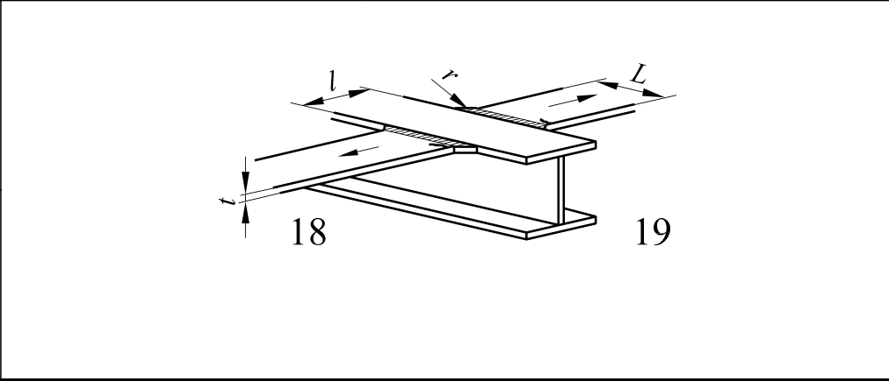

# EC3 · 8.3 · dettaglio 18, 19

[Pagina estratta](../pages/ec3-028.md) · [PDF originale](../../sources/ec3.pdf#page=28)

## Classificazione riportata

Come
particolare
1 nel
prospetto
8.5
Come
particolare
4 nel
prospetto
8.4

## Descrizione e condizioni

18) Saldature di testa
trasversali in
corrispondenza di ali che
si intersecano.

19) Con raggi di raccordo
secondo il particolare 4
del prospetto 8.4.

## Requisiti e note

Particolari 18) e 19):
La curva di fatica del
componente
continuo deve essere
verificata con il
particolare 4 o
particolare 5 del
prospetto 8.4.

> Estrazione documentale da verificare. Le categorie non sono valori di progetto pronti per il calcolo. Celle condivise e varianti non vanno separate dalle condizioni.

## Tabella completa

