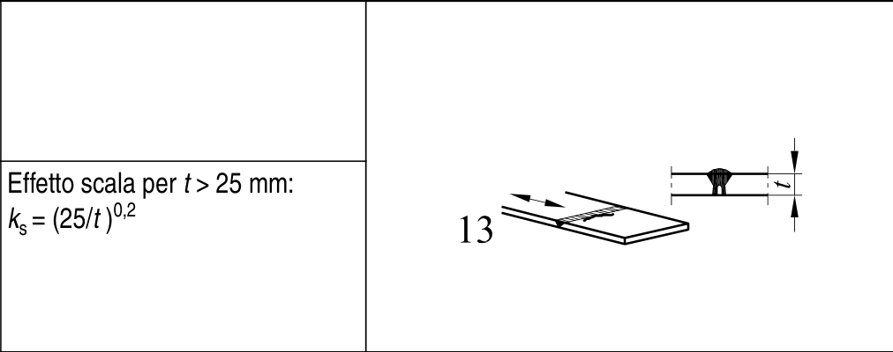

# EC3 · 8.3 · dettaglio 13

[Pagina estratta](../pages/ec3-028.md) · [PDF originale](../../sources/ec3.pdf#page=28)

## Classificazione riportata

36
71

## Descrizione e condizioni

13) Saldature di testa
eseguite da un solo lato.

13) Saldature di testa
eseguite da un solo lato
quando la completa
penetrazione è verificata
da appropriato NDT.

## Requisiti e note

13) Senza piatto
posteriore.

> Estrazione documentale da verificare. Le categorie non sono valori di progetto pronti per il calcolo. Celle condivise e varianti non vanno separate dalle condizioni.

## Tabella completa

