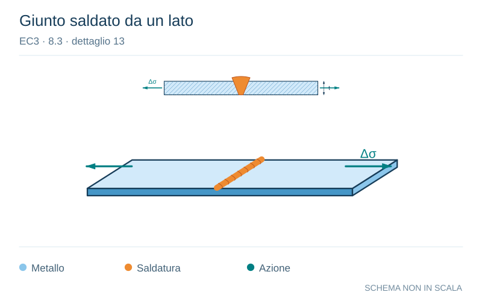

# EC3 · 8.3 · dettaglio 13

[Pagina estratta](../pages/ec3-028.md) · [PDF originale](../../sources/ec3.pdf#page=28)

**Giunto saldato da un lato.** Disegno vettoriale non in scala. [Apri / scarica il disegno SVG](../../assets/illustrations/ec3-028-t01-d02.svg).

Il blu rappresenta gli elementi metallici, l’arancio le saldature e il turchese le azioni. Simboli e proporzioni hanno funzione schematica; classi, dimensioni limite e condizioni applicabili sono quelle riportate nella fonte.

## Classificazione riportata

36
71

## Descrizione e condizioni

13) Saldature di testa
eseguite da un solo lato.

13) Saldature di testa
eseguite da un solo lato
quando la completa
penetrazione è verificata
da appropriato NDT.

## Requisiti e note

13) Senza piatto
posteriore.

> Estrazione documentale da verificare. Le categorie non sono valori di progetto pronti per il calcolo. Celle condivise e varianti non vanno separate dalle condizioni.

## Contesto della classificazione

[Celle della tabella in Markdown](../tables/ec3-028-t01.md) · [Tabella nel PDF di riferimento](../../sources/ec3.pdf#page=28).
