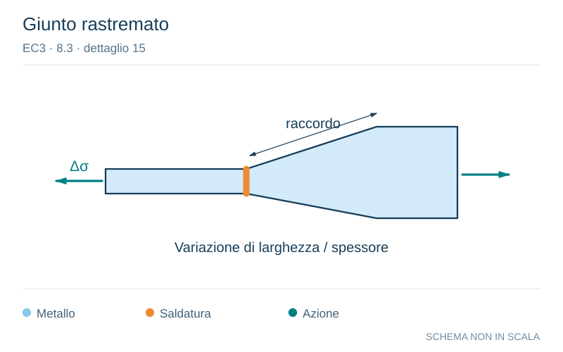

# EC3 · 8.3 · dettaglio 15

[Pagina estratta](../pages/ec3-028.md) · [PDF originale](../../sources/ec3.pdf#page=28)

**Giunto rastremato.** Disegno vettoriale non in scala. [Apri / scarica il disegno SVG](../../assets/illustrations/ec3-028-t01-d03-02.svg).

Il blu rappresenta gli elementi metallici, l’arancio le saldature e il turchese le azioni. Simboli e proporzioni hanno funzione schematica; classi, dimensioni limite e condizioni applicabili sono quelle riportate nella fonte.

## Classificazione riportata

71

## Descrizione e condizioni

Con piatto posteriore:
14) Giunti trasversali.
15) Saldature di testa
trasversali in piastre o
piatti rastremati nella
larghezza o nello
spessore con una
pendenza ≤1⁄4.
Valida anche per piastre
curve.

## Requisiti e note

Particolari 14) e 15):
I cordoni di saldatura
che fissano il piatto
posteriore devono
terminare ad una
distanza ≥10 mm dai
bordi della piastra
sollecitata.
Punti di saldatura
all’interno delle
giunzioni saldate di
testa.

> Estrazione documentale da verificare. Le categorie non sono valori di progetto pronti per il calcolo. Celle condivise e varianti non vanno separate dalle condizioni.

## Contesto della classificazione

[Celle della tabella in Markdown](../tables/ec3-028-t01.md) · [Tabella nel PDF di riferimento](../../sources/ec3.pdf#page=28).
