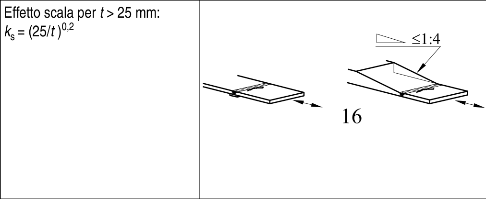
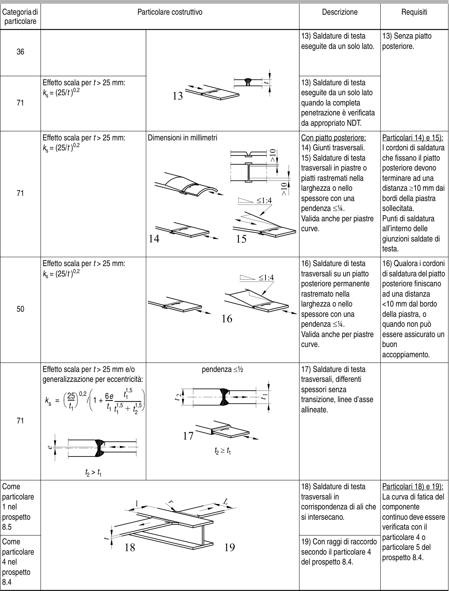

# EC3 · 8.3 · dettaglio 16

[Pagina estratta](../pages/ec3-028.md) · [PDF originale](../../sources/ec3.pdf#page=28)

## Classificazione riportata

50

## Descrizione e condizioni

16) Saldature di testa
trasversali su un piatto
posteriore permanente
rastremato nella
larghezza o nello
spessore con una
pendenza ≤1⁄4.
Valida anche per piastre
curve.

## Requisiti e note

16) Qualora i cordoni
di saldatura del piatto
posteriore finiscano
ad una distanza
<10 mm dal bordo
della piastra, o
quando non può
essere assicurato un
buon
accoppiamento.

> Estrazione documentale da verificare. Le categorie non sono valori di progetto pronti per il calcolo. Celle condivise e varianti non vanno separate dalle condizioni.

## Tabella completa

