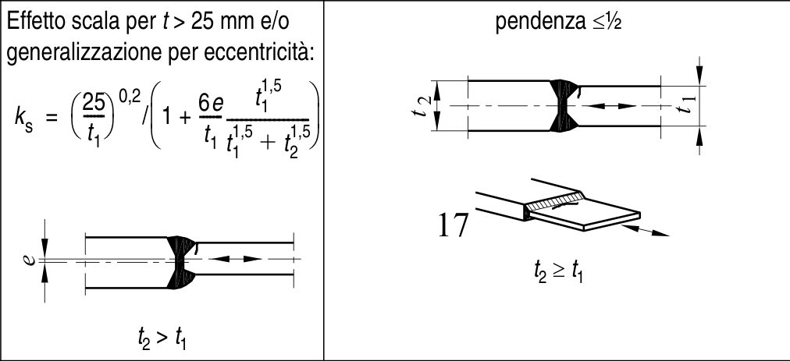

# EC3 · 8.3 · dettaglio 17

[Pagina estratta](../pages/ec3-028.md) · [PDF originale](../../sources/ec3.pdf#page=28)

## Classificazione riportata

71

## Descrizione e condizioni

17) Saldature di testa
trasversali, differenti
spessori senza
transizione, linee d’asse
allineate.

## Requisiti e note

> Estrazione documentale da verificare. Le categorie non sono valori di progetto pronti per il calcolo. Celle condivise e varianti non vanno separate dalle condizioni.

## Tabella completa

