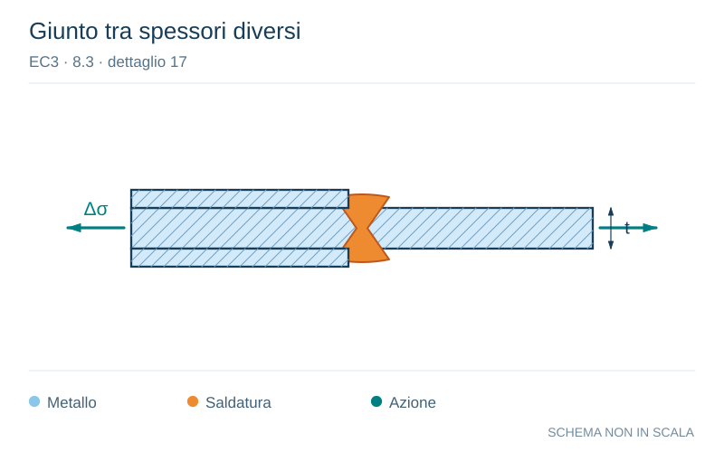

# EC3 · 8.3 · dettaglio 17

[Pagina estratta](../pages/ec3-028.md) · [PDF originale](../../sources/ec3.pdf#page=28)

**Giunto tra spessori diversi.** Disegno vettoriale non in scala. [Apri / scarica il disegno SVG](../../assets/illustrations/ec3-028-t01-d05.svg).

Il blu rappresenta gli elementi metallici, l’arancio le saldature e il turchese le azioni. Simboli e proporzioni hanno funzione schematica; classi, dimensioni limite e condizioni applicabili sono quelle riportate nella fonte.

## Classificazione riportata

71

## Descrizione e condizioni

17) Saldature di testa
trasversali, differenti
spessori senza
transizione, linee d’asse
allineate.

## Requisiti e note

> Estrazione documentale da verificare. Le categorie non sono valori di progetto pronti per il calcolo. Celle condivise e varianti non vanno separate dalle condizioni.

## Contesto della classificazione

[Celle della tabella in Markdown](../tables/ec3-028-t01.md) · [Tabella nel PDF di riferimento](../../sources/ec3.pdf#page=28).
