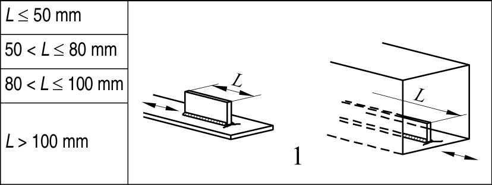

# EC3 · 8.4 · dettaglio 1

[Pagina estratta](../pages/ec3-029.md) · [PDF originale](../../sources/ec3.pdf#page=29)

## Classificazione riportata

80
71
63
56

## Descrizione e condizioni

Elementi collegati longitudinali:
1) La categoria del particolare
varia in funzione della lunghezza
dell’elemento collegato L.

## Requisiti e note

Lo spessore dell’elemento
collegato deve essere minore
della sua altezza. Altrimenti
vedere prospetto 8.5,
particolari 5 o 6.

> Estrazione documentale da verificare. Le categorie non sono valori di progetto pronti per il calcolo. Celle condivise e varianti non vanno separate dalle condizioni.

## Tabella completa

