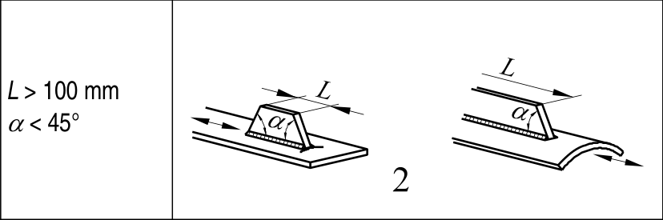
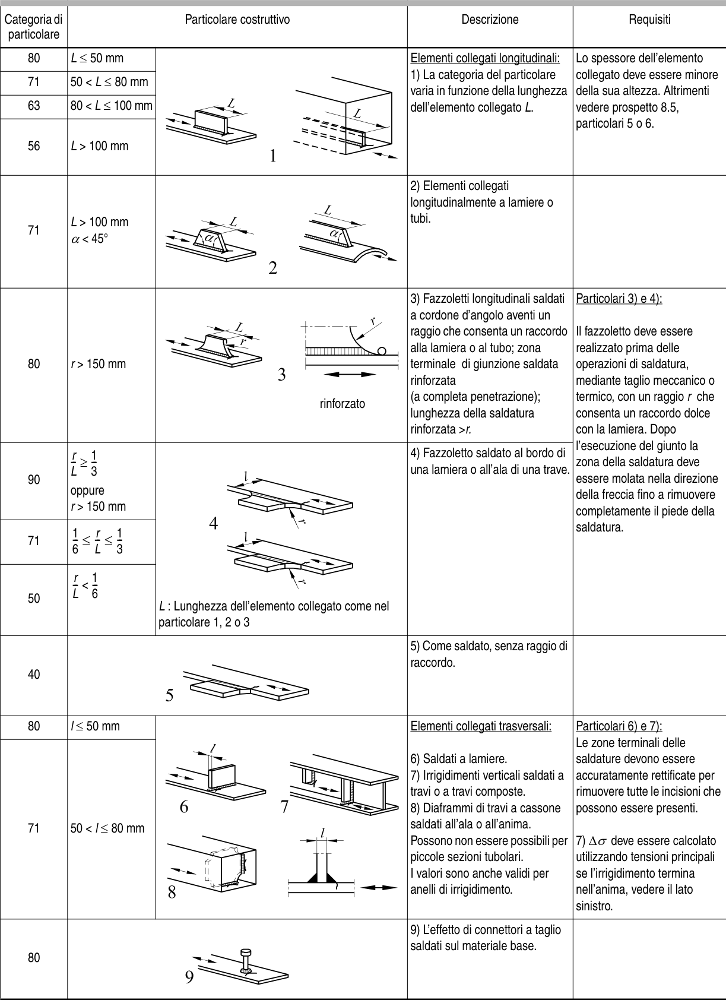

# EC3 · 8.4 · dettaglio 2

[Pagina estratta](../pages/ec3-029.md) · [PDF originale](../../sources/ec3.pdf#page=29)

## Classificazione riportata

71

## Descrizione e condizioni

2) Elementi collegati
longitudinalmente a lamiere o
tubi.

## Requisiti e note

> Estrazione documentale da verificare. Le categorie non sono valori di progetto pronti per il calcolo. Celle condivise e varianti non vanno separate dalle condizioni.

## Tabella completa

