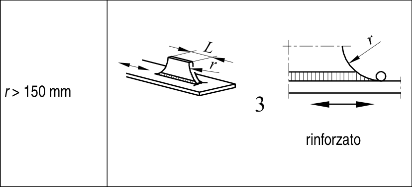

# EC3 · 8.4 · dettaglio 3

[Pagina estratta](../pages/ec3-029.md) · [PDF originale](../../sources/ec3.pdf#page=29)

## Classificazione riportata

80

## Descrizione e condizioni

3) Fazzoletti longitudinali saldati
a cordone d’angolo aventi un
raggio che consenta un raccordo
alla lamiera o al tubo; zona
terminale di giunzione saldata
rinforzata
(a completa penetrazione);
lunghezza della saldatura
rinforzata >r.

## Requisiti e note

Particolari 3) e 4):

Il fazzoletto deve essere
realizzato prima delle
operazioni di saldatura,
mediante taglio meccanico o
termico, con un raggio r che
consenta un raccordo dolce
con la lamiera. Dopo
l’esecuzione del giunto la
zona della saldatura deve
essere molata nella direzione
della freccia fino a rimuovere
completamente il piede della
saldatura.

> Estrazione documentale da verificare. Le categorie non sono valori di progetto pronti per il calcolo. Celle condivise e varianti non vanno separate dalle condizioni.

## Tabella completa

