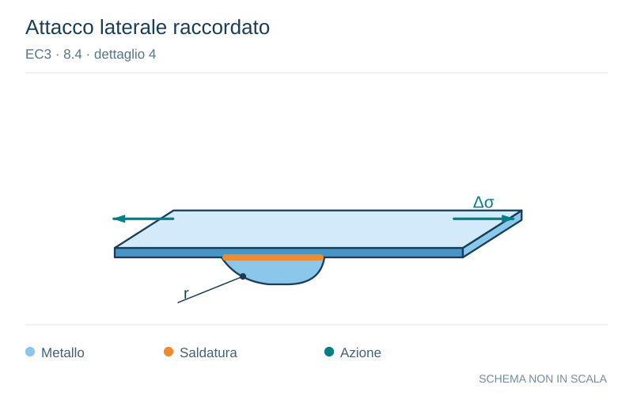

# EC3 · 8.4 · dettaglio 4

[Pagina estratta](../pages/ec3-029.md) · [PDF originale](../../sources/ec3.pdf#page=29)

**Attacco laterale raccordato.** Disegno vettoriale non in scala. [Apri / scarica il disegno SVG](../../assets/illustrations/ec3-029-t01-d06.svg).

Il blu rappresenta gli elementi metallici, l’arancio le saldature e il turchese le azioni. Simboli e proporzioni hanno funzione schematica; classi, dimensioni limite e condizioni applicabili sono quelle riportate nella fonte.

## Classificazione riportata

90
71
50

## Descrizione e condizioni

4) Fazzoletto saldato al bordo di
una lamiera o all’ala di una trave.

## Requisiti e note

Particolari 3) e 4):

Il fazzoletto deve essere
realizzato prima delle
operazioni di saldatura,
mediante taglio meccanico o
termico, con un raggio r che
consenta un raccordo dolce
con la lamiera. Dopo
l’esecuzione del giunto la
zona della saldatura deve
essere molata nella direzione
della freccia fino a rimuovere
completamente il piede della
saldatura.

> Estrazione documentale da verificare. Le categorie non sono valori di progetto pronti per il calcolo. Celle condivise e varianti non vanno separate dalle condizioni.

## Contesto della classificazione

[Celle della tabella in Markdown](../tables/ec3-029-t01.md) · [Tabella nel PDF di riferimento](../../sources/ec3.pdf#page=29).
