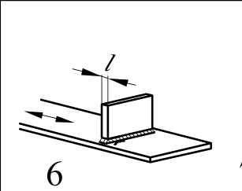

# EC3 · 8.4 · dettaglio 6

[Pagina estratta](../pages/ec3-029.md) · [PDF originale](../../sources/ec3.pdf#page=29)

## Classificazione riportata

80
71

## Descrizione e condizioni

Elementi collegati trasversali:

6) Saldati a lamiere.
7) Irrigidimenti verticali saldati a
travi o a travi composte.
8) Diaframmi di travi a cassone
saldati all’ala o all’anima.
Possono non essere possibili per
piccole sezioni tubolari.
I valori sono anche validi per
anelli di irrigidimento.

## Requisiti e note

Particolari 6) e 7):
Le zone terminali delle
saldature devono essere
accuratamente rettificate per
rimuovere tutte le incisioni che
possono essere presenti.

7) ∆σ deve essere calcolato
utilizzando tensioni principali
se l’irrigidimento termina
nell’anima, vedere il lato
sinistro.

> Estrazione documentale da verificare. Le categorie non sono valori di progetto pronti per il calcolo. Celle condivise e varianti non vanno separate dalle condizioni.

## Tabella completa

