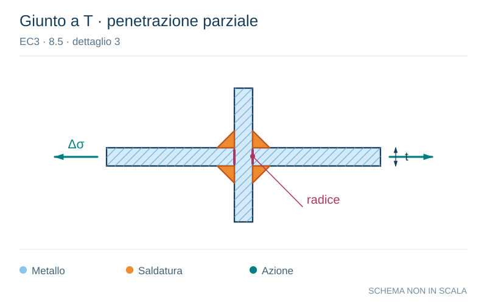

# EC3 · 8.5 · dettaglio 3

[Pagina estratta](../pages/ec3-030.md) · [PDF originale](../../sources/ec3.pdf#page=30)

**Giunto a T · penetrazione parziale.** Disegno vettoriale non in scala. [Apri / scarica il disegno SVG](../../assets/illustrations/ec3-030-t01-d02.svg).

Il blu rappresenta gli elementi metallici, l’arancio le saldature e il turchese le azioni. Simboli e proporzioni hanno funzione schematica; classi, dimensioni limite e condizioni applicabili sono quelle riportate nella fonte.

## Classificazione riportata

36*

## Descrizione e condizioni

3) Collasso alla radice della
saldatura in giunzioni a T
saldate di testa a parziale
penetrazione o collegamenti
saldati a cordoni d’angolo e
completa penetrazione
efficace in collegamenti a T
saldati di testa

## Requisiti e note

1) Ispezione trovata esente da
discontinuità e disallineamenti al
di fuori delle tolleranze della
EN 1090.
2) Per valutare ∆σ, utilizzare la
tensione nominale modificata.
3) Nei collegamenti a parziale
penetrazione sono richieste due
verifiche a fatica. In accordo alla
prima verifica, la cricca alla
radice è verificata considerando
le tensioni definite nel punto 5,
utilizzando la categoria 36* per
∆σw e la categoria 80 per ∆τw. In
accordo alla seconda verifica, la
cricca al piede della saldatura è
verificata determinando ∆σ nelle
lamiere caricate.

Particolari da 1) a 3):
Si raccomanda che i
disallineamenti delle lamiere
soggette a carichi non eccedano
il 15% dello spessore della
lamiera intermedia.

> Estrazione documentale da verificare. Le categorie non sono valori di progetto pronti per il calcolo. Celle condivise e varianti non vanno separate dalle condizioni.

## Contesto della classificazione

[Celle della tabella in Markdown](../tables/ec3-030-t01.md) · [Tabella nel PDF di riferimento](../../sources/ec3.pdf#page=30).
