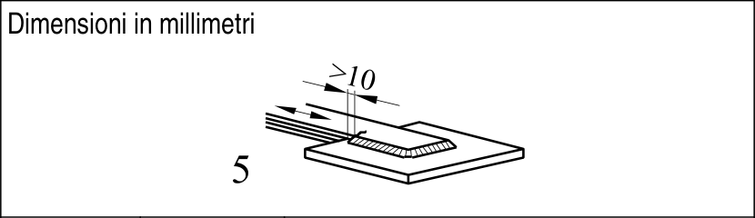

# EC3 · 8.5 · dettaglio 5

[Pagina estratta](../pages/ec3-030.md) · [PDF originale](../../sources/ec3.pdf#page=30)

## Classificazione riportata

45*

## Descrizione e condizioni

Sovrapposizioni:

5) Collegamenti per
sovrapposizione con
saldatura a cordoni d’angolo.

## Requisiti e note

4) ∆σ nella lamiera principale
deve essere calcolata sulla base
dell’area mostrata nello schizzo.
5) ∆σ deve essere calcolata
nelle lamiere di sovrapposizione.

Particolari 4) e 5):
- Estremità della saldatura a più
di 10 mm dal bordo della lamiera.
- Si raccomanda che la frattura
per taglio in una saldatura sia
verificata utilizzando il particolare
8).

> Estrazione documentale da verificare. Le categorie non sono valori di progetto pronti per il calcolo. Celle condivise e varianti non vanno separate dalle condizioni.

## Tabella completa

