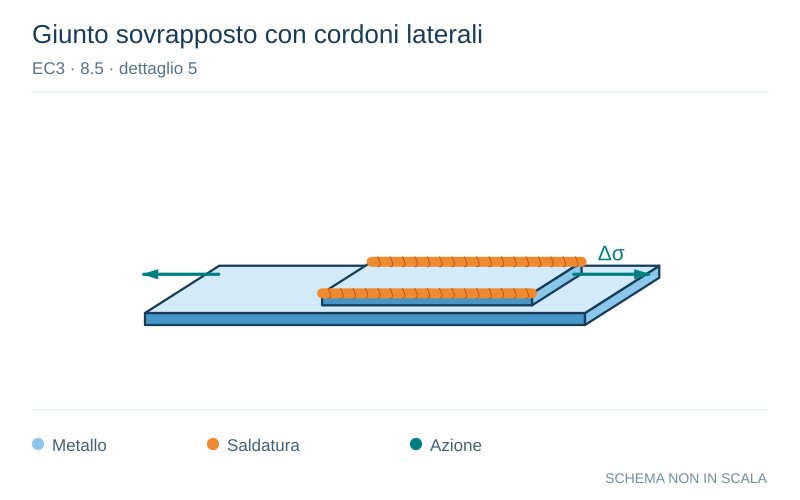

# EC3 · 8.5 · dettaglio 5

[Pagina estratta](../pages/ec3-030.md) · [PDF originale](../../sources/ec3.pdf#page=30)

**Giunto sovrapposto con cordoni laterali.** Disegno vettoriale non in scala. [Apri / scarica il disegno SVG](../../assets/illustrations/ec3-030-t01-d04.svg).

Il blu rappresenta gli elementi metallici, l’arancio le saldature e il turchese le azioni. Simboli e proporzioni hanno funzione schematica; classi, dimensioni limite e condizioni applicabili sono quelle riportate nella fonte.

## Classificazione riportata

45*

## Descrizione e condizioni

Sovrapposizioni:

5) Collegamenti per
sovrapposizione con
saldatura a cordoni d’angolo.

## Requisiti e note

4) ∆σ nella lamiera principale
deve essere calcolata sulla base
dell’area mostrata nello schizzo.
5) ∆σ deve essere calcolata
nelle lamiere di sovrapposizione.

Particolari 4) e 5):
- Estremità della saldatura a più
di 10 mm dal bordo della lamiera.
- Si raccomanda che la frattura
per taglio in una saldatura sia
verificata utilizzando il particolare
8).

> Estrazione documentale da verificare. Le categorie non sono valori di progetto pronti per il calcolo. Celle condivise e varianti non vanno separate dalle condizioni.

## Contesto della classificazione

[Celle della tabella in Markdown](../tables/ec3-030-t01.md) · [Tabella nel PDF di riferimento](../../sources/ec3.pdf#page=30).
