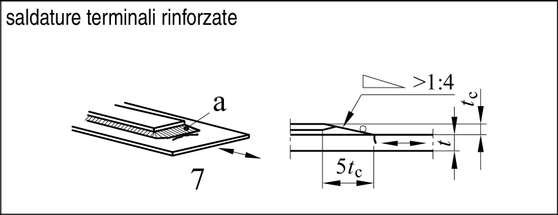

# EC3 · 8.5 · dettaglio 7

[Pagina estratta](../pages/ec3-031.md) · [PDF originale](../../sources/ec3.pdf#page=31)

## Classificazione riportata

56

## Descrizione e condizioni

7) Piastre coprigiunto in travi e
travi composte.
La minima lunghezza della
saldatura rinforzata è 5 tc.

## Requisiti e note

7) Saldatura trasversale nel tratto
terminale livellata mediante
rettifica. In aggiunta, se tc> 20 mm,
lato frontale della piastra rettificata
con una pendenza minore di <1⁄4.

> Estrazione documentale da verificare. Le categorie non sono valori di progetto pronti per il calcolo. Celle condivise e varianti non vanno separate dalle condizioni.

## Tabella completa

