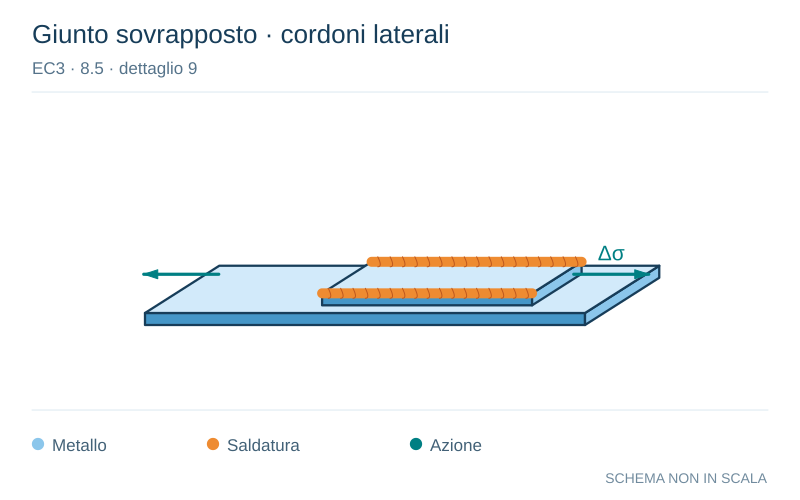

# EC3 · 8.5 · dettaglio 9

[Pagina estratta](../pages/ec3-031.md) · [PDF originale](../../sources/ec3.pdf#page=31)

**Giunto sovrapposto · cordoni laterali.** Disegno vettoriale non in scala. [Apri / scarica il disegno SVG](../../assets/illustrations/ec3-031-t01-d02-02.svg).

Il blu rappresenta gli elementi metallici, l’arancio le saldature e il turchese le azioni. Simboli e proporzioni hanno funzione schematica; classi, dimensioni limite e condizioni applicabili sono quelle riportate nella fonte.

## Classificazione riportata

80
m = 5

## Descrizione e condizioni

8) Saldature continue a
cordone d’angolo soggette a
taglio, come saldature tra
anima ed ala in travi
composte.
9) Collegamenti per
sovrapposizione con
saldatura a cordoni d’angolo.

## Requisiti e note

8) ∆τ deve essere calcolata in
base all’area della sezione di gola
della saldatura.
9) ∆τ calcolato in base all’area
della sezione di gola della
saldatura considerando la
lunghezza totale della saldatura.
Estremità della saldatura a più di
10 mm dal bordo della lamiera,
vedere anche i particolari 4) e 5)
riportati sopra.

> Estrazione documentale da verificare. Le categorie non sono valori di progetto pronti per il calcolo. Celle condivise e varianti non vanno separate dalle condizioni.

## Contesto della classificazione

[Celle della tabella in Markdown](../tables/ec3-031-t01.md) · [Tabella nel PDF di riferimento](../../sources/ec3.pdf#page=31).
