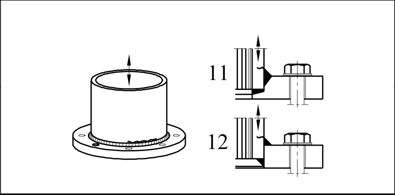

# EC3 · 8.5 · dettaglio 11, 12

[Pagina estratta](../pages/ec3-031.md) · [PDF originale](../../sources/ec3.pdf#page=31)

## Classificazione riportata

71
40

## Descrizione e condizioni

11) Collegamento di tubo con
manicotto avente saldature di
testa a penetrazione completa
all’80%.

12) Collegamento di tubo con
manicotto avente saldature a
cordoni d’angolo.

## Requisiti e note

11) Piede della saldatura
rettificato. ∆σ valutato
nell’elemento tubolare.

12) ∆σ valutato nell’elemento
tubolare.

> Estrazione documentale da verificare. Le categorie non sono valori di progetto pronti per il calcolo. Celle condivise e varianti non vanno separate dalle condizioni.

## Tabella completa

