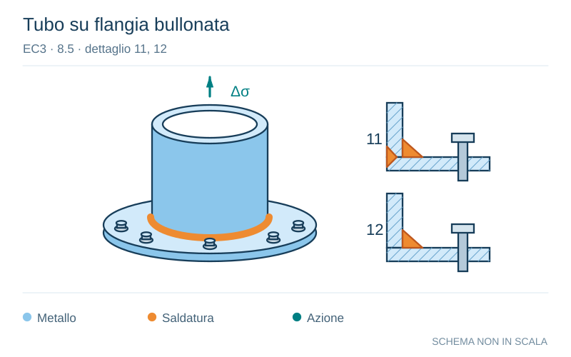

# EC3 · 8.5 · dettaglio 11, 12

[Pagina estratta](../pages/ec3-031.md) · [PDF originale](../../sources/ec3.pdf#page=31)

**Tubo su flangia bullonata.** Disegno vettoriale non in scala. [Apri / scarica il disegno SVG](../../assets/illustrations/ec3-031-t01-d04.svg).

Il blu rappresenta gli elementi metallici, l’arancio le saldature e il turchese le azioni. Simboli e proporzioni hanno funzione schematica; classi, dimensioni limite e condizioni applicabili sono quelle riportate nella fonte.

## Classificazione riportata

71
40

## Descrizione e condizioni

11) Collegamento di tubo con
manicotto avente saldature di
testa a penetrazione completa
all’80%.

12) Collegamento di tubo con
manicotto avente saldature a
cordoni d’angolo.

## Requisiti e note

11) Piede della saldatura
rettificato. ∆σ valutato
nell’elemento tubolare.

12) ∆σ valutato nell’elemento
tubolare.

> Estrazione documentale da verificare. Le categorie non sono valori di progetto pronti per il calcolo. Celle condivise e varianti non vanno separate dalle condizioni.

## Contesto della classificazione

[Celle della tabella in Markdown](../tables/ec3-031-t01.md) · [Tabella nel PDF di riferimento](../../sources/ec3.pdf#page=31).
