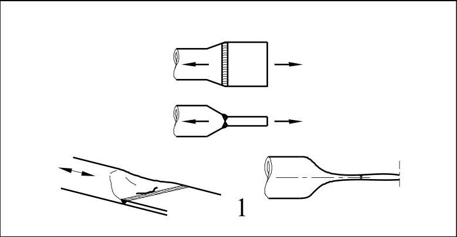
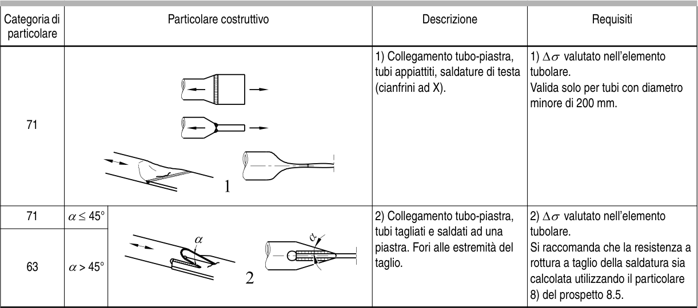

# EC3 · 8.6 · dettaglio 1

[Pagina estratta](../pages/ec3-031.md) · [PDF originale](../../sources/ec3.pdf#page=31)

## Classificazione riportata

71

## Descrizione e condizioni

1) Collegamento tubo-piastra,
tubi appiattiti, saldature di testa
(cianfrini ad X).

## Requisiti e note

1) ∆σ valutato nell’elemento
tubolare.
Valida solo per tubi con diametro
minore di 200 mm.

> Estrazione documentale da verificare. Le categorie non sono valori di progetto pronti per il calcolo. Celle condivise e varianti non vanno separate dalle condizioni.

## Tabella completa

