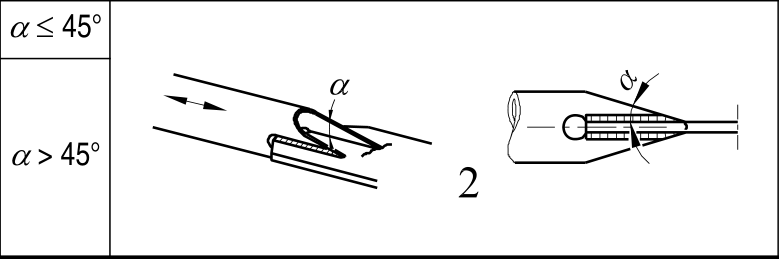

# EC3 · 8.6 · dettaglio 2

[Pagina estratta](../pages/ec3-031.md) · [PDF originale](../../sources/ec3.pdf#page=31)

## Classificazione riportata

71
63

## Descrizione e condizioni

2) Collegamento tubo-piastra,
tubi tagliati e saldati ad una
piastra. Fori alle estremità del
taglio.

## Requisiti e note

2) ∆σ valutato nell’elemento
tubolare.
Si raccomanda che la resistenza a
rottura a taglio della saldatura sia
calcolata utilizzando il particolare
8) del prospetto 8.5.

> Estrazione documentale da verificare. Le categorie non sono valori di progetto pronti per il calcolo. Celle condivise e varianti non vanno separate dalle condizioni.

## Tabella completa

