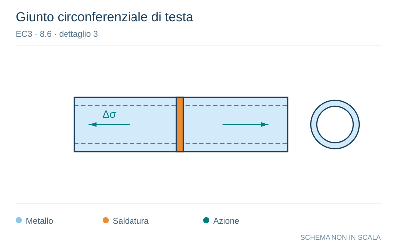

# EC3 · 8.6 · dettaglio 3

[Pagina estratta](../pages/ec3-032.md) · [PDF originale](../../sources/ec3.pdf#page=32)

**Giunto circonferenziale di testa.** Disegno vettoriale non in scala. [Apri / scarica il disegno SVG](../../assets/illustrations/ec3-032-t01-d01.svg).

Il blu rappresenta gli elementi metallici, l’arancio le saldature e il turchese le azioni. Simboli e proporzioni hanno funzione schematica; classi, dimensioni limite e condizioni applicabili sono quelle riportate nella fonte.

## Classificazione riportata

71

## Descrizione e condizioni

Saldature di testa
trasversali:
3) Saldature testa a testa
di profilati tubolari a
sezione circolare.

## Requisiti e note

Particolari 3) e 4):
- Altezza del sovrametallo
≤10% della larghezza della
saldatura, con transizione
graduale.
- Saldature eseguite in
piano, ispezionate e trovate
esenti da difetti al di fuori
delle tolleranze della
EN 1090.
- Se t > 8 mm classificare
aumentando la categoria di
particolare di 2 volte.

> Estrazione documentale da verificare. Le categorie non sono valori di progetto pronti per il calcolo. Celle condivise e varianti non vanno separate dalle condizioni.

## Contesto della classificazione

[Celle della tabella in Markdown](../tables/ec3-032-t01.md) · [Tabella nel PDF di riferimento](../../sources/ec3.pdf#page=32).
