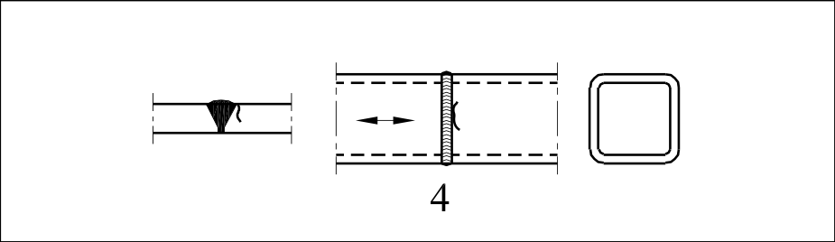

# EC3 · 8.6 · dettaglio 4

[Pagina estratta](../pages/ec3-032.md) · [PDF originale](../../sources/ec3.pdf#page=32)

## Classificazione riportata

56

## Descrizione e condizioni

4) Saldature testa a testa
di profilati tubolari a
sezione rettangolare.

## Requisiti e note

Particolari 3) e 4):
- Altezza del sovrametallo
≤10% della larghezza della
saldatura, con transizione
graduale.
- Saldature eseguite in
piano, ispezionate e trovate
esenti da difetti al di fuori
delle tolleranze della
EN 1090.
- Se t > 8 mm classificare
aumentando la categoria di
particolare di 2 volte.

> Estrazione documentale da verificare. Le categorie non sono valori di progetto pronti per il calcolo. Celle condivise e varianti non vanno separate dalle condizioni.

## Tabella completa

