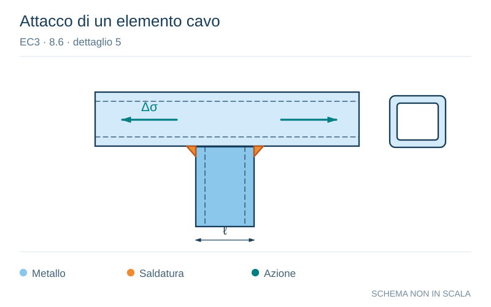

# EC3 · 8.6 · dettaglio 5

[Pagina estratta](../pages/ec3-032.md) · [PDF originale](../../sources/ec3.pdf#page=32)

**Attacco di un elemento cavo.** Disegno vettoriale non in scala. [Apri / scarica il disegno SVG](../../assets/illustrations/ec3-032-t01-d03.svg).

Il blu rappresenta gli elementi metallici, l’arancio le saldature e il turchese le azioni. Simboli e proporzioni hanno funzione schematica; classi, dimensioni limite e condizioni applicabili sono quelle riportate nella fonte.

## Classificazione riportata

71

## Descrizione e condizioni

Elementi collegati
mediante saldatura:
5) Profilati tubolari a
sezione circolare o
rettangolare saldati a
cordone d’angolo ad altro
profilato.

## Requisiti e note

5)
- Saldature non soggette a
carico.
- Larghezza parallela alla
direzione della tensione
l ≤ 100 mm.
- Per gli altri casi vedere
prospetto 8.4.

> Estrazione documentale da verificare. Le categorie non sono valori di progetto pronti per il calcolo. Celle condivise e varianti non vanno separate dalle condizioni.

## Contesto della classificazione

[Celle della tabella in Markdown](../tables/ec3-032-t01.md) · [Tabella nel PDF di riferimento](../../sources/ec3.pdf#page=32).
