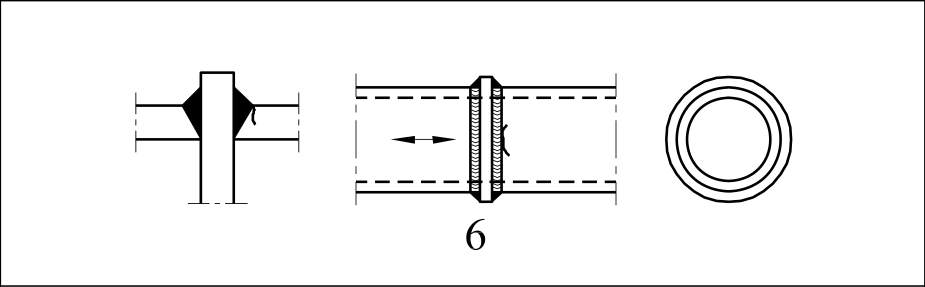
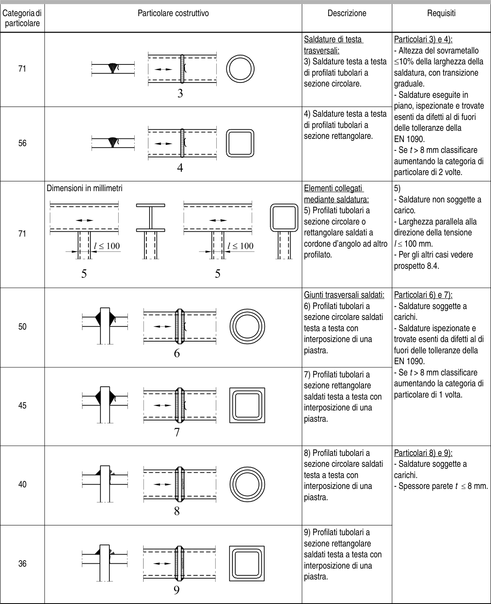

# EC3 · 8.6 · dettaglio 6

[Pagina estratta](../pages/ec3-032.md) · [PDF originale](../../sources/ec3.pdf#page=32)

## Classificazione riportata

50

## Descrizione e condizioni

Giunti trasversali saldati:
6) Profilati tubolari a
sezione circolare saldati
testa a testa con
interposizione di una
piastra.

## Requisiti e note

Particolari 6) e 7):
- Saldature soggette a
carichi.
- Saldature ispezionate e
trovate esenti da difetti al di
fuori delle tolleranze della
EN 1090.
- Se t > 8 mm classificare
aumentando la categoria di
particolare di 1 volta.

> Estrazione documentale da verificare. Le categorie non sono valori di progetto pronti per il calcolo. Celle condivise e varianti non vanno separate dalle condizioni.

## Tabella completa

