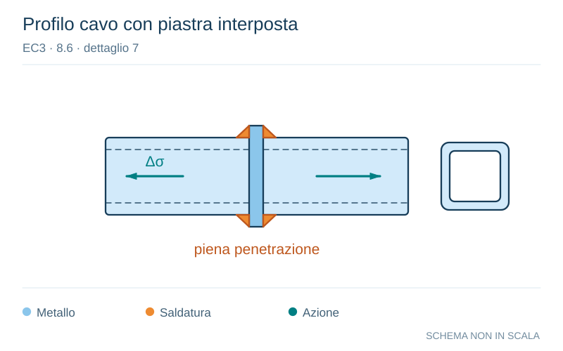

# EC3 · 8.6 · dettaglio 7

[Pagina estratta](../pages/ec3-032.md) · [PDF originale](../../sources/ec3.pdf#page=32)

**Profilo cavo con piastra interposta.** Disegno vettoriale non in scala. [Apri / scarica il disegno SVG](../../assets/illustrations/ec3-032-t01-d05.svg).

Il blu rappresenta gli elementi metallici, l’arancio le saldature e il turchese le azioni. Simboli e proporzioni hanno funzione schematica; classi, dimensioni limite e condizioni applicabili sono quelle riportate nella fonte.

## Classificazione riportata

45

## Descrizione e condizioni

7) Profilati tubolari a
sezione rettangolare
saldati testa a testa con
interposizione di una
piastra.

## Requisiti e note

Particolari 6) e 7):
- Saldature soggette a
carichi.
- Saldature ispezionate e
trovate esenti da difetti al di
fuori delle tolleranze della
EN 1090.
- Se t > 8 mm classificare
aumentando la categoria di
particolare di 1 volta.

> Estrazione documentale da verificare. Le categorie non sono valori di progetto pronti per il calcolo. Celle condivise e varianti non vanno separate dalle condizioni.

## Contesto della classificazione

[Celle della tabella in Markdown](../tables/ec3-032-t01.md) · [Tabella nel PDF di riferimento](../../sources/ec3.pdf#page=32).
