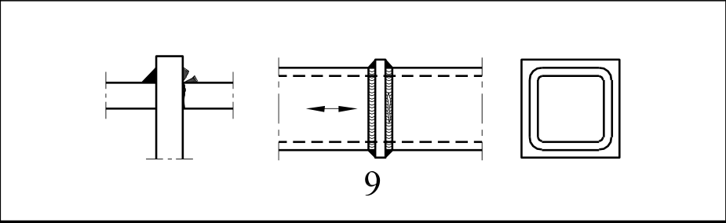

# EC3 · 8.6 · dettaglio 9

[Pagina estratta](../pages/ec3-032.md) · [PDF originale](../../sources/ec3.pdf#page=32)

## Classificazione riportata

36

## Descrizione e condizioni

9) Profilati tubolari a
sezione rettangolare
saldati testa a testa con
interposizione di una
piastra.

## Requisiti e note

Particolari 8) e 9):
- Saldature soggette a
carichi.
- Spessore parete t ≤ 8 mm.

> Estrazione documentale da verificare. Le categorie non sono valori di progetto pronti per il calcolo. Celle condivise e varianti non vanno separate dalle condizioni.

## Tabella completa

