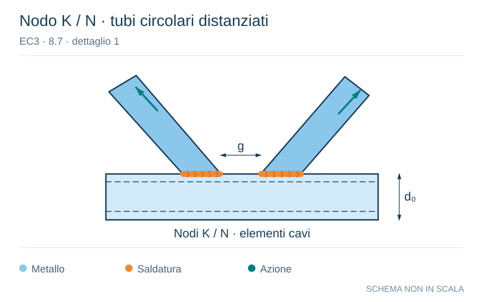

# EC3 · 8.7 · dettaglio 1

[Pagina estratta](../pages/ec3-033.md) · [PDF originale](../../sources/ec3.pdf#page=33)

**Nodo K / N · tubi circolari distanziati.** Disegno vettoriale non in scala. [Apri / scarica il disegno SVG](../../assets/illustrations/ec3-033-t01-d01.svg).

Il blu rappresenta gli elementi metallici, l’arancio le saldature e il turchese le azioni. Simboli e proporzioni hanno funzione schematica; classi, dimensioni limite e condizioni applicabili sono quelle riportate nella fonte.

## Classificazione riportata

90
m = 5
45
m = 5

## Descrizione e condizioni

t0        Collegamenti con elementi diagonali distanziati alle estremità:
 --- ≥ 2,0
 ti         Particolare 1): collegamenti a K ed a N, profilati tubolari a
          sezione circolare

t0
--- = 1,0
ti

## Requisiti e note

Particolari 1) e 2):
-  Sono necessarie valutazioni separate per le corde e
   per i controventi.
-  Per valori intermedi del rapporto to/ti interpolare
   linearmente tra le categorie di particolare.
-   Saldature a cordone d’angolo permesse per
   controventi con spessore delle pareti t ≤ 8 mm.
-    to e ti ≤ 8 mm.
-  35° ≤θ ≤ 50°.
-   b0/t0 × t0/ti ≤ 25.
-   d0/t0 × t0/ti ≤ 25.
-   0,4 ≤bi /b0 ≤ 1,0.
-  0,25 ≤di /d0 ≤ 1,0.
-   b0 ≤ 200 mm.
-   d0 ≤ 300 mm.
-   -0,5h0 ≤ei/p ≤ 0,25h0.
-   -0,5d0 ≤ei/p ≤ 0,25d0.
-   eo/p ≤ 0,02b0 oppure ≤ 0,02d0.
[eo/p è l’eccentricità fuori dal piano]

Particolare 2):
0,5(bo - bi) ≤g ≤ 1,1 (bo - bi) e g ≤ 2to

> Estrazione documentale da verificare. Le categorie non sono valori di progetto pronti per il calcolo. Celle condivise e varianti non vanno separate dalle condizioni.

## Contesto della classificazione

[Celle della tabella in Markdown](../tables/ec3-033-t01.md) · [Tabella nel PDF di riferimento](../../sources/ec3.pdf#page=33).
