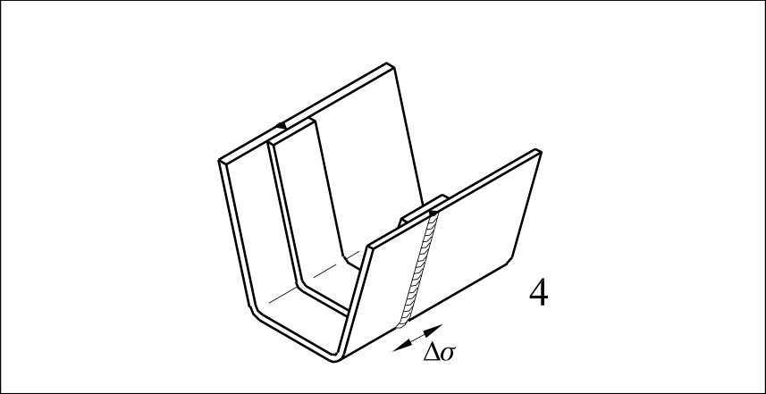
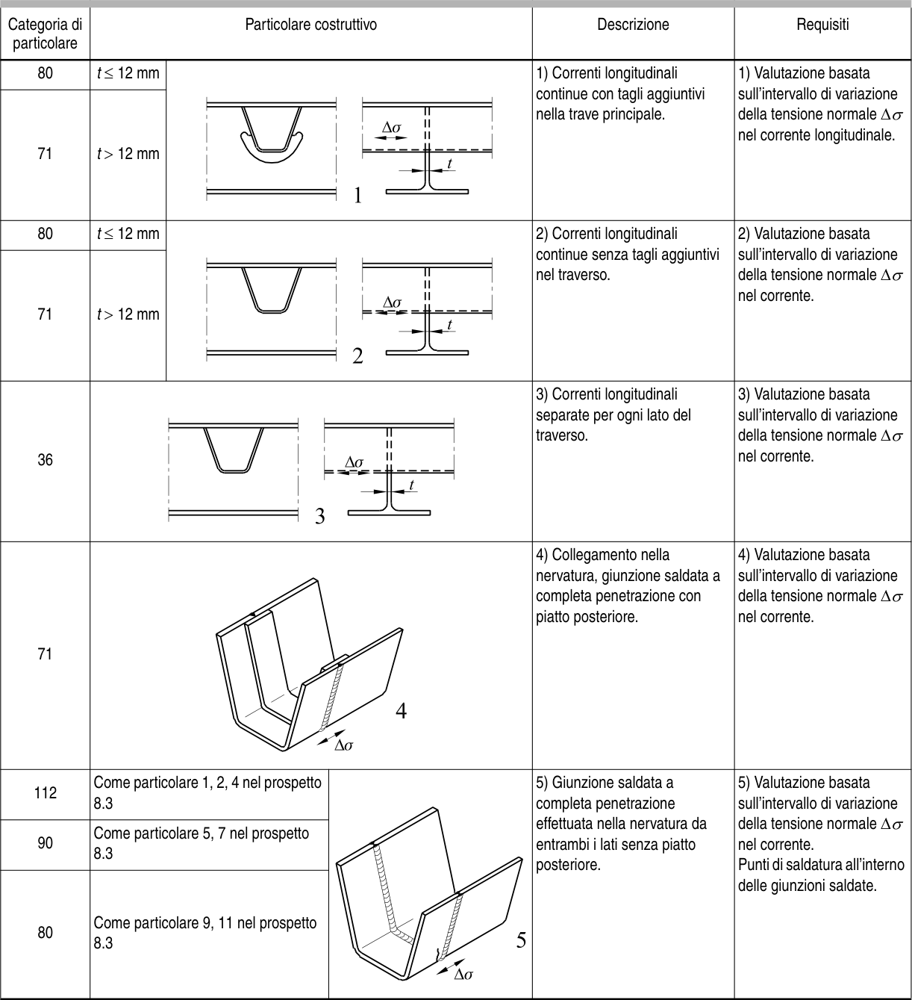

# EC3 · 8.8 · dettaglio 4

[Pagina estratta](../pages/ec3-034.md) · [PDF originale](../../sources/ec3.pdf#page=34)

## Classificazione riportata

71

## Descrizione e condizioni

4) Collegamento nella
nervatura, giunzione saldata a
completa penetrazione con
piatto posteriore.

## Requisiti e note

4) Valutazione basata
sull’intervallo di variazione
della tensione normale ∆σ
nel corrente.

> Estrazione documentale da verificare. Le categorie non sono valori di progetto pronti per il calcolo. Celle condivise e varianti non vanno separate dalle condizioni.

## Tabella completa

