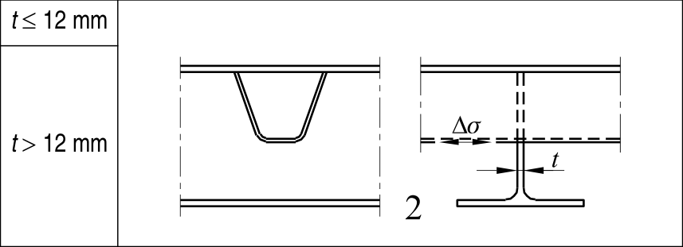

# EC3 · 8.8 · dettaglio 2

[Pagina estratta](../pages/ec3-034.md) · [PDF originale](../../sources/ec3.pdf#page=34)

## Classificazione riportata

80
71

## Descrizione e condizioni

2) Correnti longitudinali
continue senza tagli aggiuntivi
nel traverso.

## Requisiti e note

2) Valutazione basata
sull’intervallo di variazione
della tensione normale ∆σ
nel corrente.

> Estrazione documentale da verificare. Le categorie non sono valori di progetto pronti per il calcolo. Celle condivise e varianti non vanno separate dalle condizioni.

## Tabella completa

