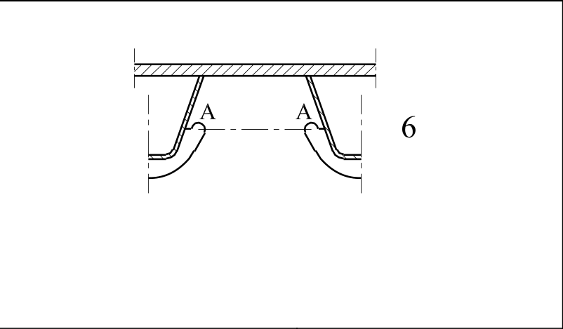

# EC3 · 8.8 · dettaglio 6

[Pagina estratta](../pages/ec3-035.md) · [PDF originale](../../sources/ec3.pdf#page=35)

## Classificazione riportata

71

## Descrizione e condizioni

6) Sezione critica nell’anima
della trave dovuta a tagli.

## Requisiti e note

6) Valutazione basata
sull’intervallo di variazione della
tensione che tiene conto degli
effetti Vierendeel.
Nota    Nel   caso     in    cui
           l’intervallo  di variazione
          della     tensione    è
        determinato secondo    il
        punto  9.4.2.2(3)   della
      EN 1993-2, può essere
          utilizzata la categoria di
          particolare 112.

> Estrazione documentale da verificare. Le categorie non sono valori di progetto pronti per il calcolo. Celle condivise e varianti non vanno separate dalle condizioni.

## Tabella completa

